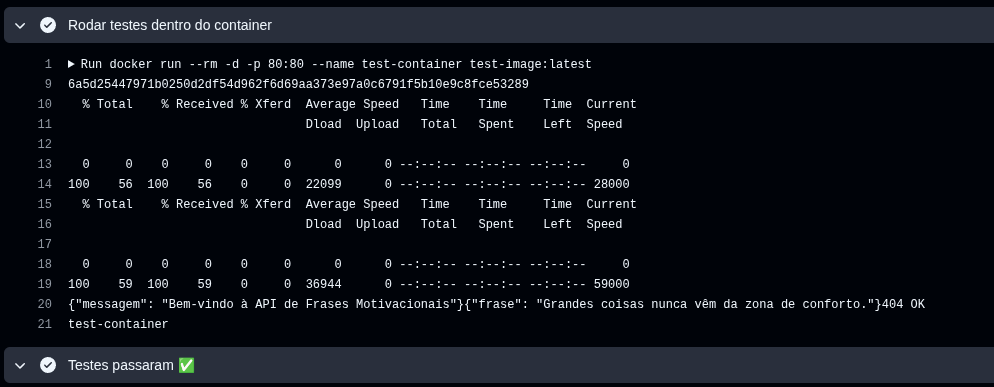
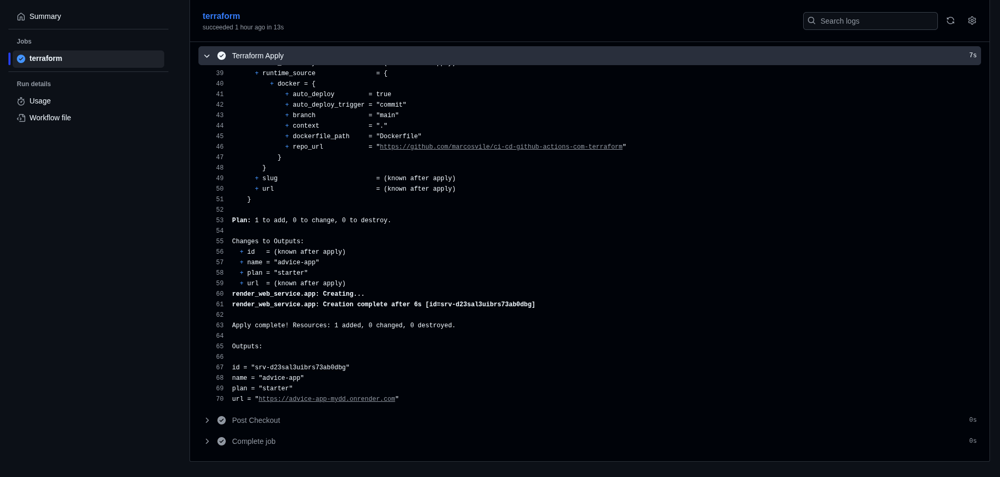
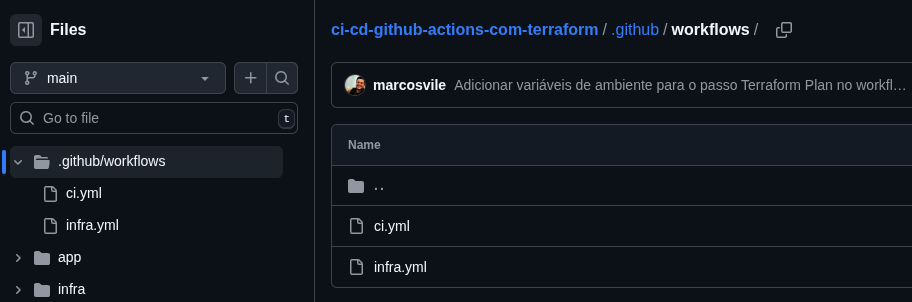
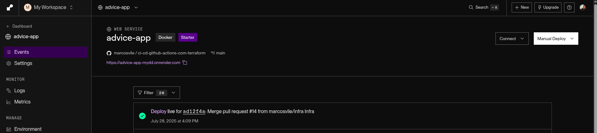
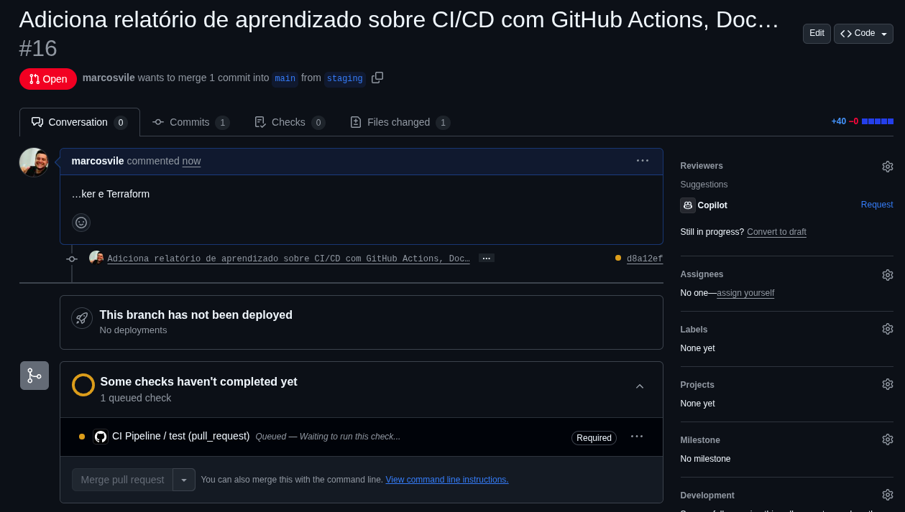
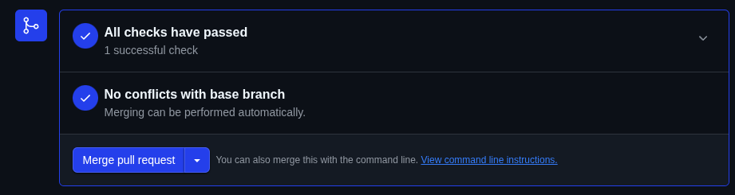
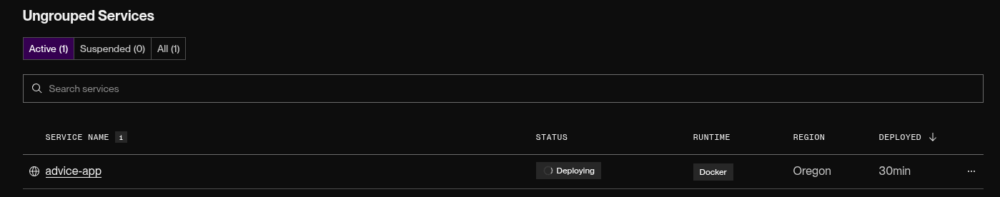
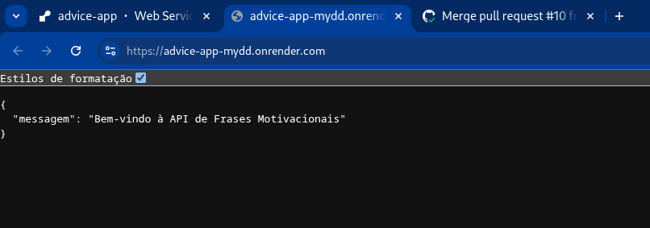
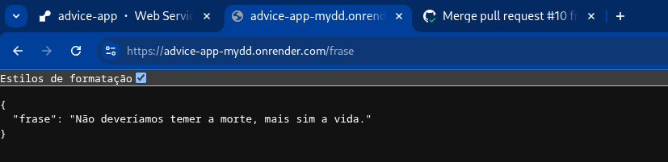

# Relatório de Aprendizado: CI/CD com GitHub Actions, Docker e Terraform

### Infraestrutura como Código com Terraform

* Reforcei os conceitos de infraestrutura como código utilizando o Terraform.

### Estrutura e Boas Práticas

* Mantive o projeto organizado com separação clara entre a aplicação (`/app`) e a infraestrutura (`/infra`), mas mantendo tudo em um único repositório para facilitar o gerenciamento.
* Utilizei arquivos como `.gitignore`, `.dockerignore` e `.editorconfig` para padronização e segurança do repositório, garantindo que arquivos e informações desnecessárias fosse versionadas ou copiadas para a imagem.
* Uso de dependências Python de forma adequada com `requirements.txt`.

### Integração Completa do Pipeline

* Experimentei o ciclo completo de CI/CD:

  * Construção e empacotamento da aplicação com Docker.
  * Testes simples com Curl nas rotas.
  
  * Provisionamento da infraestrutura com push na branch `infra`.
  
  * Implantação automatizada com push na branch `main` para atualizações na aplicação.

## Dificuldades Enfrentadas

* Havia um tempo que não utilizava o Terraform, então foi necessário revisar a documentação oficial para compreender novamente a sintaxe de módulos e garantir a compatibilidade com as versões mais recentes.
* Como não conhecia o provedor Render anteriormente, precisei de um tempo adicional para estudar a documentação. Isso foi importante para entender como o Render realiza implantações automáticas com base em commits na branch `main`.

## Ferramentas de Apoio Utilizadas

Durante o desenvolvimento deste projeto, foram utilizadas ferramentas de inteligência artificial para aumentar a produtividade e auxiliar na tomada de decisões técnicas:

* **ChatGPT (OpenAI)**: utilizado para esclarecimento de dúvidas, sugestões de estrutura de código e correção de erros.
* **GitHub Copilot** com Claude Sonnet 3.7 (Anthropic): assistente de codificação para acelerar o desenvolvimento da aplicação e arquivos de infraestrutura.

## Conclusão

Durante o processo de desenvolvimento, a todo momento foi documentado e ajustado no Readme.md do repositório o passo a passo de cada etapa, também comitado para cada conjunto de alterações em um commit separado, garantido o entendimento e rastreabilidade do projeto, sem misturar contextos diferentes entre commites.

Decidi separar o workflow em CI e Infra, ficando mais fácil para entender e não misturar as responsabilidades de cada um.

Como extra configurei particulamente a implantação no Render, garantindo que a aplicação fosse atualizada automaticamente com cada push na branch `main`

e inseri uma camada de checagem de testes antes de liberar o merge na main, para evitar que mesmo em caso de falhas no GitHub Actions, o merge não fosse realizado na `main`, impedindo que o Render aplicasse uma versão com falhas, isso acarreta a necessidade de uma ação manual na aprovação da PR, no entanto, garante a qualidade do código que será implantado.

Optei por adotar um fluxo separado para a infraestrutura, evitando que cada push na branch `main` disparasse um novo provisionamento. Dessa forma, previno erros causados por tentativas de recriação de recursos já existentes e garanto que atualizações na infraestrutura ocorram apenas quando realmente necessário ou por meio de uma execução manual dedicada.

## Aplicação

